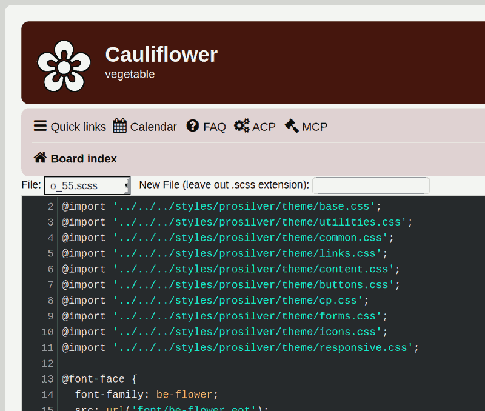
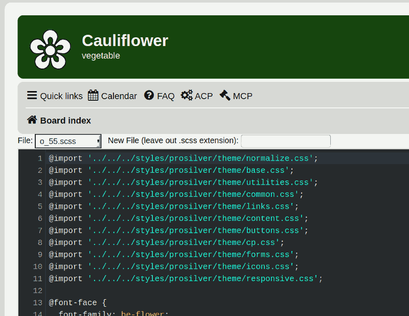

# PhpBB Extension - marttiphpbb Scss Dev

[Topic on phpBB.com](https://www.phpbb.com/community/viewtopic.php?f=456&t=2492276)

## Requirements

* phpBB 3.3+
* PHP 7.1+
* The [Codemirror helper extension](https://github.com/marttiphpbb/phpbb-ext-codemirror)
* Run `composer update` in order to install the [scssphp/scssphp](http://scssphp.github.io/scssphp/) scss compiler.

## Quick Install

You can install this on the latest release of phpBB by following the steps below:

* Create `marttiphpbb/scssdev` in the `ext` directory.
* Download and unpack the repository into `ext/marttiphpbb/scssdev`
* Enable `Scss Dev` in the ACP at `Customise -> Manage extensions`.
* You can start editing in the ACP at `Extensions` -> `Scss Dev`.

## Uninstall

* Disable `Scss Dev` in the ACP at `Customise -> Extension Management -> Extensions`.
* To permanently uninstall, click `Delete Data` (the `store/marttiphpbb/scssdev` directory will be removed automatically). Optionally delete the `/ext/marttiphpbb/scssdev` directory.

## Support

* Report bugs and other issues to the [Issue Tracker](https://github.com/marttiphpbb/phpbb-ext-scssdev/issues).

## License

[GPL-2.0](license.txt)
